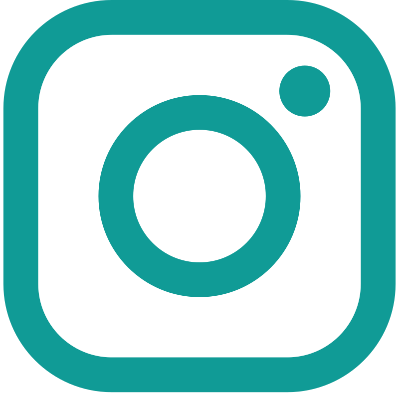
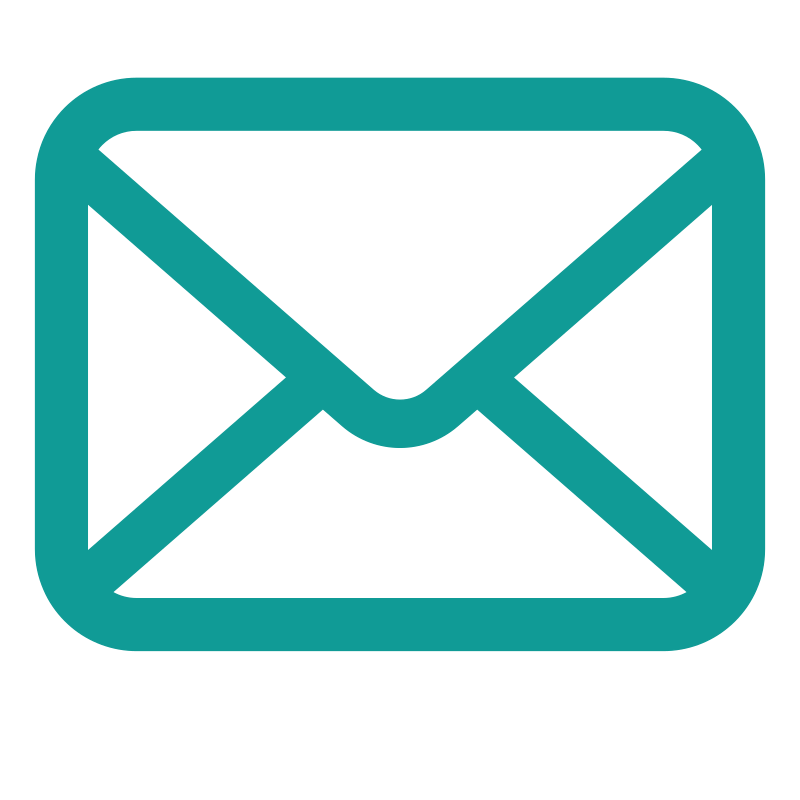
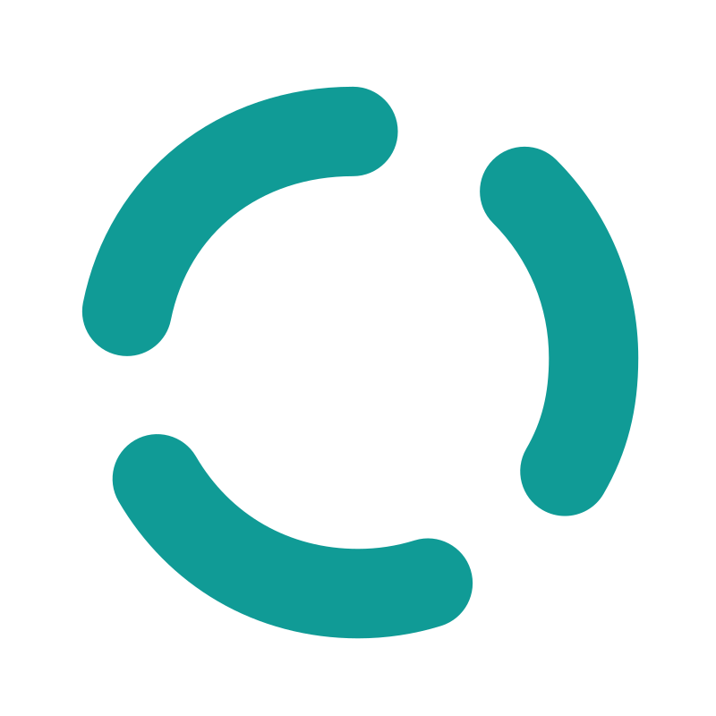

  

  

  
  
  
  

  

## About Me

<pre>
Hi, my name's Krish.

Here you will find some of the projects I've worked on or am currently working on.

Frequently work with: .c, .asm, .py, .cpp, .sv, .go, .ts, .java
Currently learning: .rs

You might know me from...
- <a href="https://www.ubcformulaelectric.com/">UBC formula Electric</a> - Firmware Dev
- <a href="https://www.nanopulseos.org/">nanopulseOS</a> - full bare metal OS (Monolithic)
- <a href="https://www.csdcms.ca/">CANSAT</a> - Canadian Satellite Design Challenge - Team Idealite
- <a href="https://github.com/kryptoish/runix.cloud">Runix.cloud</a> - homelab server for use of public (soon) (might rebrand)
- <a href="https://www.krishthakur.com/work/Auto-Crawler">Auto-Crawler</a> - autonomous quadroped simulation using DDPG algorithm

</pre>
 

  

<!--
**kryptoish/kryptoish** is a ✨ _special_ ✨ repository because its `README.md` (this file) appears on your GitHub profile.

Here are some ideas to get you started:

- 🔭 I’m currently working on ...
- 🌱 I’m currently learning ...
- 👯 I’m looking to collaborate on ...
- 🤔 I’m looking for help with ...
- 💬 Ask me about ...
- 📫 How to reach me: ...
- 😄 Pronouns: ...
- ⚡ Fun fact: ...
-->
